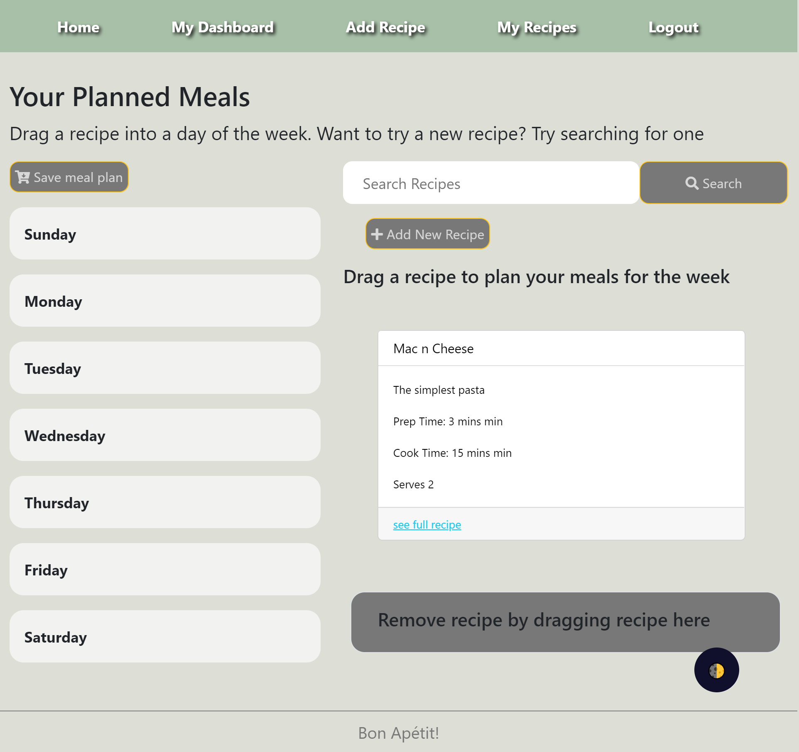
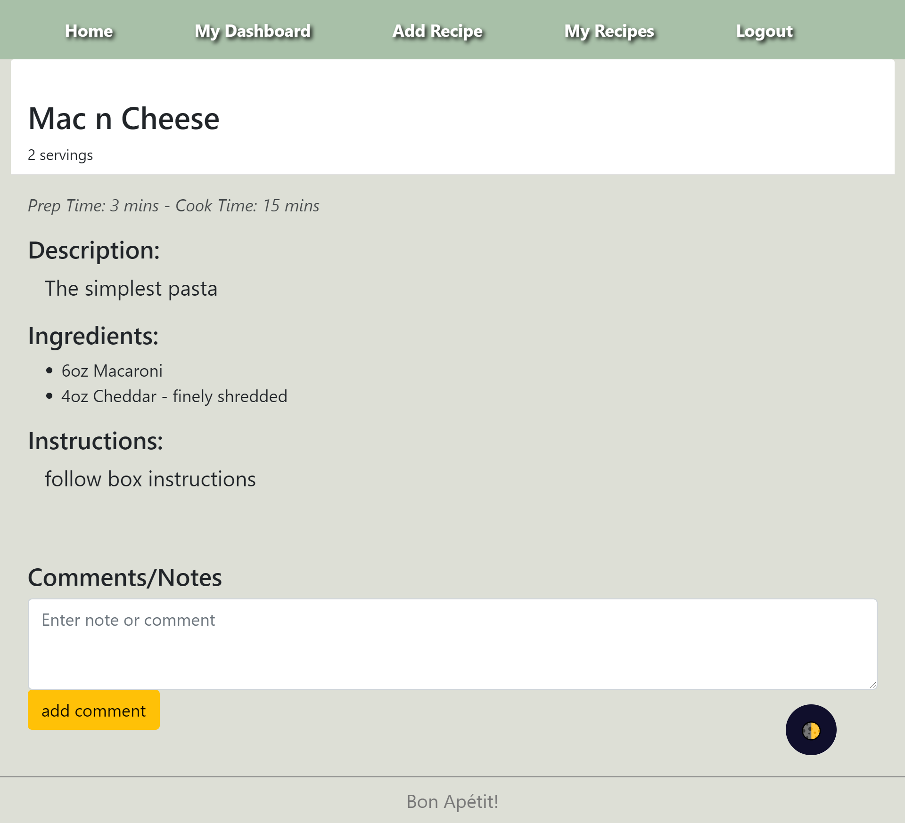

# Meal Plan

## Description
Website designed to make planning this week's dinners easier

## Screenshots

## Link
[Meal Plan](https://pumpkin-pie-32612.herokuapp.com/)

## Technologies
- Handlebars
- Bootstrap
- Node.js
- Express.js
- Sequelize
- MySQL
- bcrypt
- Darkmode
- Chalk

## Credits

Isabelle Bertram:
[IsiBee](https://github.com/IsiBee)
- Project Leader
- Front End
- Styles

Alex Christopherson:
[albenchris](https://github.com/albenchris)
- Api Routes
- Responsive styles

Sophia Mazurek
[sophiamazurek](https://github.com/sophiamazurek)
- Models
- Drag & Drop
- Styles 

Joshua Austin
[Jtaustin19](https://github.com/Jtaustin19)
- Darkmode